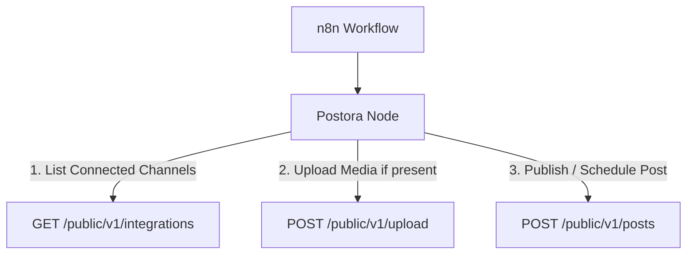

# n8n-nodes-postora

<p align="center">
  
</p>

<h1 align="center">Postora n8n Integration</h1>

<p align="center">
  <strong>The ultimate automated social media scheduling node for n8n.</strong> Manage, schedule, and publish posts to multiple channels across all major networks simultaneously.
</p>

---

## 🌟 Overview

[Postora](https://postiz.walidmohamed.com) is an open-source, self-hosted social media management tool (built on Postiz). This community node enables you to seamlessly connect n8n workflows with your Postora instance. 

For example, you can load content from RSS feeds or AI generators, process or format it, automatically upload the media, and post or schedule to multiple social media channels in one single action.

---

## ⚡ Features

*   **Simplified Create Post UI:** Choose a target platform and select multiple connected social channels dynamically.
*   **Dynamic Platform & Channel Discovery:** Lists all 33+ supported platforms in Postiz with a real-time count badge showing how many channels you have connected to each.
*   **Automated Media Uploading:** Set the media source to `URL` or `Binary Data` (local files). The node automatically handles multipart uploads to the Postora storage before making the post.
*   **Comprehensive Operations:**
    *   **Post:** Create (Publish/Schedule/Draft), Get Status, List, Delete.
    *   **Media:** Upload files directly.
    *   **AI Video:** Generate videos using AI directly via Postora's video engine.

---

## 🔌 API & Architecture Mapping

The node communicates directly with the Postora public API at `${host}/public/v1/*`. 



### 1. Dynamic Platform Listing (`getPlatforms`)
When you select the **Create** operation, n8n queries the `/integrations` endpoint. It processes your active connections and displays them inside the platform selector with real-time status count badges:
```
- Facebook (3 connected)
- LinkedIn (1 connected)
- Bluesky (0 connected)
```

### 2. Multi-channel Selection (`getAccounts`)
Once a platform is chosen, the `Social Accounts` field updates to show the connected channel names (e.g. your specific Facebook Pages or LinkedIn Profiles) as a multi-select dropdown.

### 3. Under-the-hood Post Payload Construction
The node transforms the simplified single-platform multi-account UI input into the strict, nested payload schema required by the backend:
```json
{
  "type": "now",
  "shortLink": false,
  "date": "2026-06-16T20:00:00.000Z",
  "tags": [],
  "posts": [
    {
      "integration": { "id": "channel-id-1" },
      "value": [
        {
          "content": "Your Caption Here",
          "id": "",
          "image": [
            { "id": "media-id", "path": "path/to/media.png" }
          ]
        }
      ],
      "group": "",
      "settings": {}
    }
  ]
}
```

---

## ⚙️ Credential Setup

When configuring the **Postora API** credentials in your n8n workspace:

1.  **API Key:** Your Postora organization API key (obtainable from Settings → API Keys).
2.  **Host:** The base URL of your self-hosted Postora backend instance (e.g., `https://postiz.walidmohamed.com/api`).
    > [!IMPORTANT]
    > The host URL must end with `/api`. The node automatically appends `/public/v1/` under the hood.

---

## 🚀 Installation

### Quick Installation (n8n Community Nodes UI)
1. In n8n, navigate to **Settings > Community Nodes**.
2. Click **Install a Node**.
3. Enter `n8n-nodes-postora` in the **npm Package Name** field.
4. Agree to the risks and click **Install**.

---

## 🛠️ Local Development & Debugging

If you want to modify this node or run it locally:

1.  **Clone this repository:**
    ```bash
    git clone https://github.com/lolotam/postiz-n8n-community-node.git
    cd postiz-n8n-community-node
    ```
2.  **Install dependencies and build the node:**
    ```bash
    pnpm install
    pnpm run build
    ```
3.  **Link the node to your local n8n installation:**
    *   Find your local n8n data directory (typically `~/.n8n/` or `C:\Users\<User>\.n8n\`).
    *   Create a symbolic link or junction in `~/.n8n/nodes/node_modules/n8n-nodes-postora` pointing to this directory:
        ```powershell
        # On Windows (PowerShell)
        New-Item -ItemType Junction -Path "C:\Users\<YourUser>\.n8n\nodes\node_modules\n8n-nodes-postora" -Target "C:\path\to\postiz-n8n-community-node"
        ```
    *   Add the dependency reference to `~/.n8n/nodes/package.json`:
        ```json
        "dependencies": {
          "n8n-nodes-postora": "file:C:/path/to/postiz-n8n-community-node"
        }
        ```
4.  **Restart n8n:**
    ```bash
    n8n start
    ```
